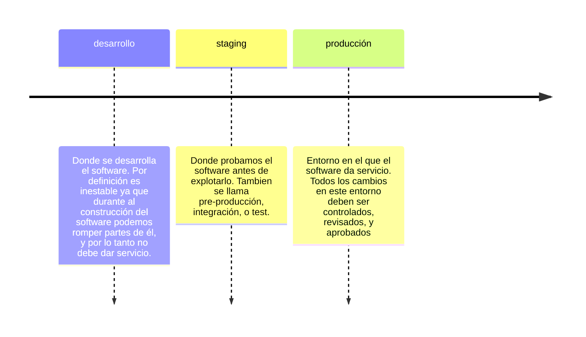

# Modelo de desarrollo

El software no se desarrolla en el mismo equipo en el que se explota (o se pone en producción).

Lo normal es tener distintos entornos:

```mermaid
timeline
   desarrollo: Donde se desarrolla el software. Por definición es inestable ya que durante al construcción del software podemos romper partes de él, y por lo tanto no debe dar servicio.
   staging: Donde probamos el software antes de explotarlo. Tambien se llama pre-producción, integración, o test.
   producción: Entorno en el que el software da servicio. Todos los cambios en este entorno deben ser controlados, revisados, y aprobados
```
