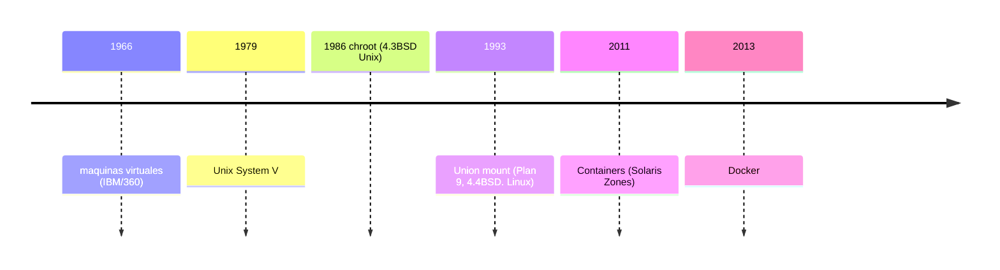

# De dónde vienen los contenedores 

Los contenedores docker toman ideas de otras soluciones anteriores:

- Máquinas virtuales: Emulación de hardware completo, permitiendo ejecutar sistemas operativos completos de forma aislada del host. Inicialmente se implementó en mainframes y sistemas de tiempo compartido. Después quedó olvidado hasta la implementación de intel en el i386.

- 4.3BSD chroot: Mecanismo de aislamiento de procesos que cambia el directorio raíz de un proceso, limitando su vista del sistema de archivos. Se implementa con la llamada al sistema [chroot(2)](https://man.netbsd.org/chroot.2)

- Solaris Zones: (originalmente Solaris Containers) Sistema de  virtualización a nivel del sistema operativo que permote crear entornos seguros y aislados entre sí (zonas) dentro de un mismo host.
- Union mount: método que permite superponer varios sistemas de archivos en una única jerarquía, de modo que el contenido de cada capa aparece como un solo árbol.
