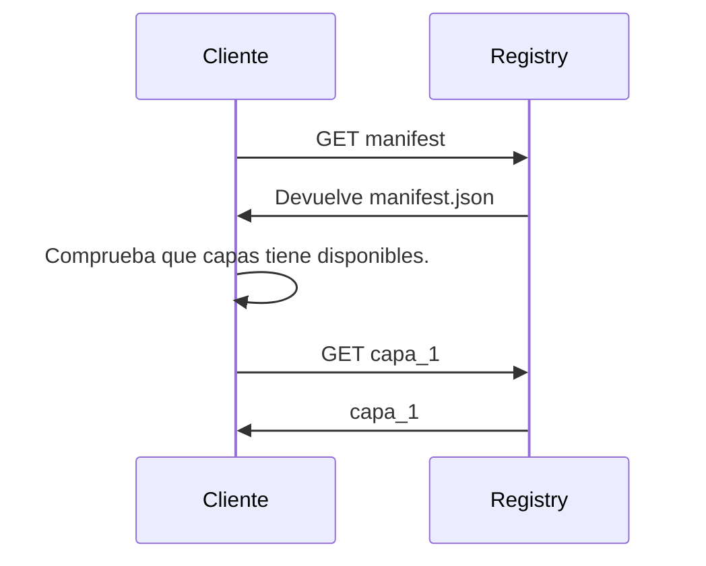

# Container package

Hay varios formatos de imágen de contenedores.

Los más comunes son docker y OCI (open container iniciative - promovido por Linux Foundation).

Para nosotros el formato de imágen es transparente: una vez cargada la imagen en el host, sólo tenemos que encargarnos de ejecutarla y/o asignar recursos.

Dentro del fichero imágen de contenedor tenemos esta información:

```
ContainerImage.tar --> El formato base es un fichero de archivo .tar
│
├─ manifest.json            <-- lista de capas + config
├─ config.json              <-- metadatos (CMD, ENV, Puertos, etc.)
├─ <layer1>.tar.gz          <-- primera capa (base)
├─ <layer2>.tar.gz          <-- segunda capa (p.ej. RUN apt‑get ...)
├─ <layer3>.tar.gz          <-- capa final (código de la app)
└─ repositories (opc.)      <-- mapeo repo:tag → digest (legacy)
```

Más adelante veremos qué son las capas, cómo se crean, y porqué son importantes.

(En el formato de contenedor OCI la información está distribuida de otra manera)

Cuando tenemos una imágen de contenedor en obtenida de un *container registry* el proceso es un poco distinto.

Para ahorrar operaciones de transferencia, y aprovechar espacio en disco, el *container registry* nos ofrecerá las distintas capas.


