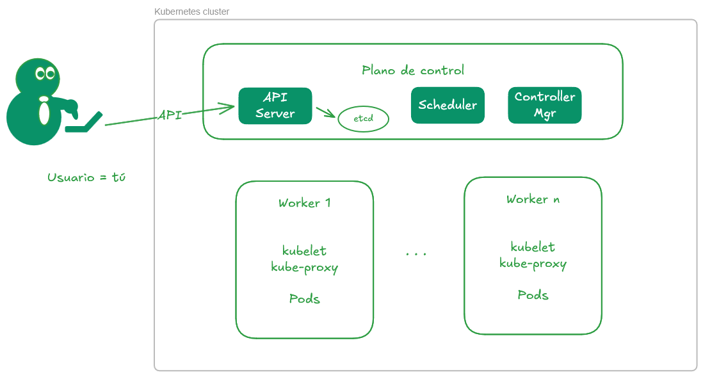

# Arquitectura de Kubernetes



Kubernetes tiene dos "planos": el plano de control, que gestiona el cluster y los `workers`, que es donde se ejecutan las cargas de trabajo.

Tú le dices a Kubernetes que ejecute _algo_ y Kubernetes se encarga de decidir dónde se ejecuta, y decirle al worker qué debe ejecutar y cómo.

OJO: El plano de control puede estar compuesto por un único nodo, o varios nodos.
Si estamos en desarrollo basta con un nodo para probar y abaratar el uso.
Cuando estamos en producción necesitamos alta disponibilidad en varios nodos (como mínimo 3 para que el algoritmo paxos funcione).

## Componentes del plano de control

### Controller Manager

Es el "cerebro" del cluster Kubernetes. Es el componente principal que gestiona todo.
Mantiene el estado actual del cluster, y el estado deseado.
Si el estado actual no coincide con el estado deseado, el Server Manager toma las acciones necesarias para corregirlo.
Esto no es necesariamente una emergencia: basta con querer añadir un Pod nuevo, o lanzar un contendor dentro del cluster para que el Server Manager tome las acciones necesarias.

### (Opcional) Cloud Controller Manager

Este component es opcional y se encarga de solicitar (¡y liberar!) recursos de la nube.
Por ejemplo, si creamos un PVC (persistent volume claim), el Cloud Controller Manager se encarga de solicitar un volumen de almacenamiento en la nube para que nuestros datos no desaparezcan.

### API Server

Es el servicio con el que interactuamos con el cluster.
Cuando ejecutamos `kubectl`, se comunica con el API Server para realizar operaciones en el cluster.

Los workers también hablan con el API Server para informar sobre el estado de sus Pods.

### etcd

Es la base de datos distribuida clave-valor que almacena el estado del cluster.
Todos los nodos del cluster necesitan tener una copia de la base de datos sincronizada entre ellos y que contenga la misma información.
De esta manera, si uno de los nodos falla, los demás pueden seguir funcionando hasta que el nodo fallido se recupere o lo sustituya otro.

Esto obliga a dimensionar correctamente el cluster ([recomendaciones de hardware para etcd](https://etcd.io/docs/v3.6/op-guide/hardware/))

## Componentes de los workers

### Pod

Un Pod es la unidad básica de Kubernetes. Contiene uno o más contenedores, y se ejecuta en un nodo worker.

La forma más fácil de ejecutar Kubernetes es teniendo un Pod por cada Worker, aunque puedes tener varios Pods dentro de un mismo Worker. 

Por ejemplo, un mismo Worker un Pod con un contenedor que ejecuta un job de procesamiento de datos (Spark, o Apache Beam), y otro Pod que envía métricas y logs a un sistema de monitoreo. Así aprovechas mejor los recursos del nodo (CPU, memoria) y mantienes la separación de responsabilidades entre los contenedores.

### Kubelet
Es el agente que se ejecuta en cada nodo worker y se encarga de gestionar los Pods en ese nodo.
Si un Pod falla, Kubelet se encarga de reiniciarlo.
Reporta salud al plano de control.

### kube-proxy

Es el agente que se ejecuta en cada nodo worker y se encarga de la configuración de la red.

Utiliza el sistema nativo del kernel para redirigir el tráfico entre Pods y Servicios (iptables/IPVS)

## Otros servicios

Esto no forma parte de Kubernetes, pero se utiliza junto con él.

## Container registry

Servicio que almacena las imágenes de contenedor que vamos a desplegar.
Es como *Docker Hub* pero privado.

Se puede desplegar un contenedor que está en un registry público (basta con tener conectividad);
pero es recomendable publicar en nuestro container registry los contendores que usamos.

¿Qué puede ir mal?

¿Y si no podemos acceeder al registry público?
¿Y si el acceso es muy lento (hay thottling)?
¿Y si el proveedor del contailer lo elimina?

Todo esto nos lo podemos evitar copiando el contenedor a nuestro propio registry:

```bash
# Obtenemos el contenedor que tomamos como base
docker pull <<contenedor_base>>
# Le cambiamos el nombre
docker tag miversion:1.0
docker push miversion:1.0 <<mi-docker-registry.com>>
```

Después construimos nuestros containers sin preocuparnos por la disponibilidad del container base, no del registry.

```dockerfile
FROM mi-docker-reginstry.com/miversion:1.2
...
<<resto>>
...
```

*OJO* algunos scripts de _kubernetes_all_in_one_ incluyen un registry local _dentro_ del cluster.
Para un laboratorio local puede ser útil; pero para un entorno de producción no es recomendable porque si eliminas el cluster, el registry se pierde.
