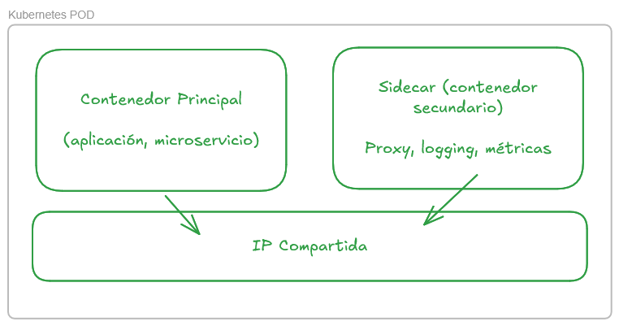

# Pods y Manifests

## ¿Qué es un Pod?



El pod es la únidad mínima de Kubernetes.
Puede tener 1 o varios contenedores.
Los contendores dentro de un pod comparten red y almacenamiento.

Hasta ahora hemos visto que al ejecutar un contenedor en kubernetes se creaba un pod:

```
$ kubectl run proxy --image nginx
pod/proxy created

$ kubctl get pods
NAME    READY   STATUS    RESTARTS   AGE
proxy   1/1     Running   0          22s```
```

Pero esta es una manera muy pobre de ejecuta cargas en un cluster.
Tenemos que tener más control sobre lo que queremos ejecutar.
Por ejemplo podemos querer configurar variables de entorno, o limitar los recursos que consume el contenedor.

Para esto usamos manifests.

## Manifests

Un manifest es un archivo de configuración que define un pod, sus contenedores, y otros recursos asociados.

Estos manifests se almacenan en un repositorio git, y se pueden versionar. Esto es importante para mantener un historial de cambios y dar marcha atrás en caso de problemas (recuerda: git bisect is your friend)

¿Cómo son estos manifests?

Fichero: [simple_pod.yaml](ejercicios_resueltos\k8s_manifests\simple_pod.yaml)
```yaml
apiVersion: v1 <---: Versión de la API
kind: Pod      <---- Tipo de recurso. Cada tipo de recurso necesita información distinta.
metadata:      <---: Información sobre el recurso.
  name: proxy-manifest  <--- Nombre del recurso.
spec:          <---: En 'spec' tenemos lo que necesitamos para definir el pod..  
  containers:  <---: Lista de contenedores. ES UNA LISTA! no sólo un único contenedor.
  - name: proxy  <--- Nombre del contenedor.
    image: nginx  <--- Imagen del contenedor.
```

Para ejecutar un pod con este manifest, usamos el comando `kubectl apply -f simple_pod.yaml`.

Podemos ver el container en ejecución:

```bash
kubectl get pods
NAME             READY   STATUS     RESTARTS      AGE
dos-containers   1/2     NotReady   4 (77s ago)   117s
proxy-manifest   1/1     Running    0             4m18s
```

Vemos que el pod 'dos-containers' no está en estado "ready" y sólo uno de los dos contenedores está levantado.

Podemos ejecutar el el comando con el switch `-w` para que se actualice a medida que hay cambios:

```
$ kubectl get pods -w
NAME             READY   STATUS     RESTARTS   AGE
dos-containers   1/2     CrashLoopBackOff   1 (9s ago)   13s
proxy-manifest   1/1     Running            0            16m
dos-containers   1/2     NotReady           2 (12s ago)   16s
dos-containers   1/2     CrashLoopBackOff   2 (28s ago)   44s
dos-containers   1/2     NotReady           3 (29s ago)   45s
```

El pod pasa de un estado not ready (no tengo todos los contenedores levantados) a un estado CrashLoopBackOff (el contenedor se está reiniciando constantemente).

¿Porqué se estrella un container ahí dentro?

Vamos a ver que está pasando con el comando `describe` de kubernetes:

```bash
kubectl describe pod dos-containers
Name:             dos-containers
Namespace:        default
Priority:         0
Service Account:  default
Node:             kind-worker/172.19.0.2
Start Time:       Tue, 02 Jun 2026 20:51:06 +0200
Labels:           <none>
Annotations:      <none>
Status:           Running
IP:               10.244.1.7
IPs:
 IP:  10.244.1.7
Containers:
 proxy:
   Container ID:   containerd://3023b5dc4e26a904dae194d341149852e6b39a04274506830c82c77a5b83ee95
   Image:          nginx
   Image ID:       docker.io/library/nginx@sha256:5aca99593157f4ae539a5dec1092a0ad8762f8e2eb1789085a13a0f5622369f6
   Port:           <none>
   Host Port:      <none>
   State:          Running
     Started:      Tue, 02 Jun 2026 20:51:07 +0200
   Ready:          True
   Restart Count:  0
   Environment:    <none>
   Mounts:
     /var/run/secrets/kubernetes.io/serviceaccount from kube-api-access-sgbrt (ro)
 busybox:
   Container ID:   containerd://a544aecaf32a0687da6c78082084166b9a183ac2a7995d174d81286ea1f78479
   Image:          busybox
   Image ID:       docker.io/library/busybox@sha256:fd8d9aa63ba2f0982b5304e1ee8d3b90a210bc1ffb5314d980eb6962f1a9715d
   Port:           <none>
   Host Port:      <none>
   State:          Waiting
     Reason:       CrashLoopBackOff
   Last State:     Terminated
     Reason:       Completed
     Exit Code:    0
     Started:      Tue, 02 Jun 2026 20:56:54 +0200
     Finished:     Tue, 02 Jun 2026 20:56:54 +0200
   Ready:          False
   Restart Count:  6
   Environment:    <none>
   Mounts:
     /var/run/secrets/kubernetes.io/serviceaccount from kube-api-access-sgbrt (ro)
Conditions:
 Type                        Status
 PodReadyToStartContainers   True
 Initialized                 True
 Ready                       False
 ContainersReady             False
 PodScheduled                True
Volumes:
 kube-api-access-sgbrt:
   Type:                    Projected (a volume that contains injected data from multiple sources)
   TokenExpirationSeconds:  3607
   ConfigMapName:           kube-root-ca.crt
   Optional:                false
   DownwardAPI:             true
QoS Class:                   BestEffort
Node-Selectors:              <none>
Tolerations:                 node.kubernetes.io/not-ready:NoExecute op=Exists for 300s
                            node.kubernetes.io/unreachable:NoExecute op=Exists for 300s
Events:
 Type     Reason     Age                    From               Message
 ----     ------     ----                   ----               -------
 Normal   Scheduled  7m59s                  default-scheduler  Successfully assigned default/dos-containers to kind-worker
 Normal   Pulling    7m59s                  kubelet            Pulling image "nginx"
 Normal   Pulled     7m58s                  kubelet            Successfully pulled image "nginx" in 615ms (615ms including waiting). Image size: 63120520 bytes.
 Normal   Created    7m58s                  kubelet            Container created
 Normal   Started    7m58s                  kubelet            Container started
 Normal   Pulled     7m57s                  kubelet            Successfully pulled image "busybox" in 629ms (629ms including waiting). Image size: 2236931 bytes.
 Normal   Pulled     7m55s                  kubelet            Successfully pulled image "busybox" in 889ms (889ms including waiting). Image size: 2236931 bytes.
 Normal   Pulled     7m43s                  kubelet            Successfully pulled image "busybox" in 611ms (611ms including waiting). Image size: 2236931 bytes.
 Normal   Pulled     7m14s                  kubelet            Successfully pulled image "busybox" in 601ms (601ms including waiting). Image size: 2236931 bytes.
 Normal   Created    6m22s (x5 over 7m57s)  kubelet            Container created
 Normal   Started    6m22s (x5 over 7m57s)  kubelet            Container started
 Normal   Pulled     6m22s                  kubelet            Successfully pulled image "busybox" in 617ms (618ms including waiting). Image size: 2236931 bytes.
 Normal   Pulling    2m12s (x7 over 7m58s)  kubelet            Pulling image "busybox"
 Warning  BackOff    46s (x10 over 7m54s)   kubelet            Back-off restarting failed container busybox in pod dos-containers_default(e3f26768-e024-4a3e-a404-3498bcd4d333)
 ```

Cuando definimos un pod, kubernetes espera que los contenedores queden en ejecución.
El container busybox se ejecuta y termina inmediatamente.
Por eso k8s nos muestra que el pod tiene 1/2 contenedores en ejecución y que está en estado Not Ready.

**Ejercicio**

Vamos a hacer que el container busybox ejecute un sleep infinity a ver que pasa.
Para esto hay que añadir `Command: ["/bin/sleep", "infinity"]` al contenedor en el pod.

¿Qué ocurre cuando intentamos aplicar el cambio con `kubectl apply -f `?
¿Cómo solucionarlo?

**Ejercicio**

¿Qué ocurre cuando nos conectamos a los contenedores en el pod?

Para conectarnos a los contenedores en el pod, podemos usar `kubectl exec` o `kubectl attach`.

Vamos a conectarnos al busybox dentro del pod `dos-containers`.
```
kubectl exec -it dos-containers -c busybox -- /bin/sh
```

Este contenedor no está ejecutando ningún servidor web; pero si ejecutamos un netcat al puerto 80 de este mismo equipo ¿qué ocurre?
```bash
$ nc -zv localhost 80
localhost (127.0.0.1:80) open
```

**¿Quién responde al puerto 80?**

Esta característica es útil para lanzar varios contenedores en un mismo pod y que compartan puertos de la red.
Por ejemplo, en vez de tener un pod por cada servicio, podemos tener un pod con todos los servicios que necesitamos sin tener que crear un contenedor "grande" que los contenga todos.


**Ejercicio**

Queremos crear un blog con WordPress y MySQL.
En vez de crear un contenedor que tenga las dos aplicaciones unidas (como si fuese una máquina virtual), podemos crear un pod con dos contenedores.

```yaml
apiVersion: v1
kind: Pod
metadata:
  name: wordpress-standalone
spec:
  containers:
    - name: wp
      image: wordpress:latest
    - name: mysql
      image: mysql:latest
```

A este pod le falta la configuración de los contenedores.
¿Qué ocurre cuando intentamos aplicar el cambio con `kubectl apply -f `?
