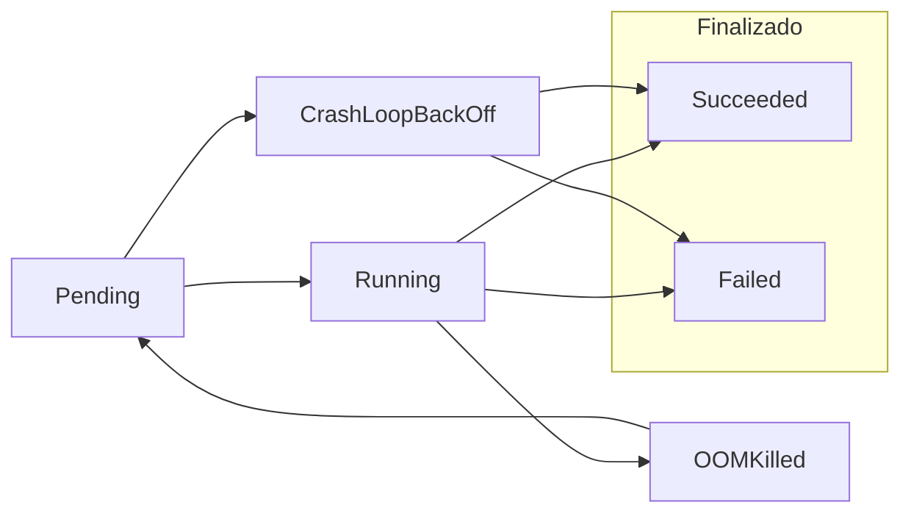
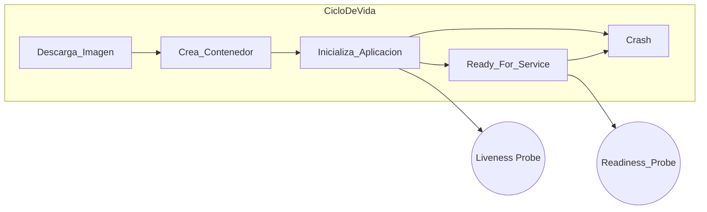

# Pods - probes

## Ciclo de vida del Pod

Los pods siguen este ciclo de vida



Cada aplicación es distinta de otra, y cada una puede definir cuándo esta "viva" y cuándo está lista para dar servicio.

Una applicación está viva cuando está en ejecución.

Puede estar dando servicio lentamente, estar inicializándose, o esperando a algún recurso; pero los procesos están en ejecución.




Kubernetes espera un tiempo desde que se crea el contenedor hasta enviarle tráfico.

Pero K8s no sabe cómo funciona la aplicación.

Por ese motivo podemos indicarle a Kubertes que use comprobaciones (probes) para saber si el contenedor está listo para recibir tráfico. Si pasado un tiempo no lo está, puede reiniciarse o ser eliminado.

Este el es Readiness Probe (¿estás listo para dar servicio?)

En la práctica:
1. Kubernetes lanzará el container.
2. El container se inicia y ejecuta la aplicación.
3. Kubernetes ejecuta el Liveness Probe (si lo hay)
4. Si pasado un tiempo el Liveness Probe no responde, K8s reinicia el contenedor. Goto 2.
5. Kubernetes ejecuta el Readiness Probe (si lo hay)
6. Si pasado un tiempo el Readiness Probe no responde, K8s deja de mandar tráfico al contedor. Servicio degradado.
7. Si el Readiness Probe responde, K8s volverá a mandar tráfico al contenedor.
8. Si el Readiness Probe sigue sin responder, y el Liveness Probe tampoco, K8s reinicia el contenedor. Goto 2.

# Cómo configurar 'probes':

Dentro de nuestro pod, definimos los probes en la sección `spec`:


```yaml
livenessProbe:
  httpGet:
    path: /healthz
    port: 8080
readinessProbe:
  httpGet:
    path: /ready
    port: 8080
```

Los probes pueden ser http, tcp, o puede ser un comenado que se ejecuta en el contenedor (en este caso, el comando debe devolver 0 si todo es correcto).


Algunas veces podemos tener un contenedor que tarda mucho en arrancar (por ejemplo, descargando pesos de un modelo). En estos casos, podemos usar `startupProbe` para esperar a que el contenedor termine de arrancar antes de considerarlo listo.

```yaml
startupProbe:
  httpGet:
    path: /startup
    port: 8080
```
