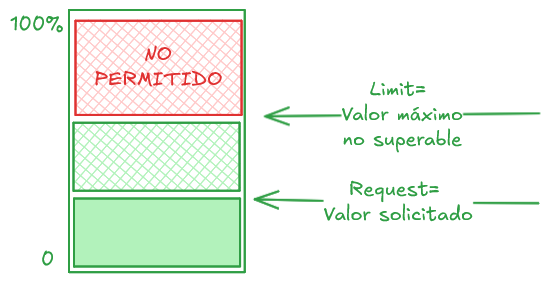

# Pods - límites

En (muchas/algunas) ocasiones nos puede interesar restringir el uso de los recursos, o garantizar unos minimos para que las cargas se ejecuten correctamente.

Limits y Requests



Tenemos dos formas de asignar resursos: limits y requests.

Una request nos garantiza que al menos se asignen los recursos solicitados.

Un limit nos limita el uso máximo: no podrá excederse el uso de ese recurso.

Los limit y request se pueden aplicar a CPU y memoria.

Recursos | Caso | Comportamiento |
---|---|---|
CPU | Limit excedido | El contenedor recibe menos tiempo de CPU 
CPU | Limit por debajo | Funcionamiento normal
CPU | Request por debajo | Funcionamiento normal - el contenedor recibe la CPU que necesita aunque esté por debajo de lo solicitado.
CPU | Request por encima | Se sige asigunando CPU al contenedor sin sobrepasar el _Limit_ solicitado (si lo hay)
Memoria | Request por debajo | Funcionamiento normal - el contenedor recibe la memoria que necesita aunque esté por debajo de lo solicitado.
Memoria | Request por encima | Se sigue asignando memoria al contenedor sin sobrepasar el _Limit_ solicitado (si lo hay)
Memoria | Limit excedido | El contenedor **SE REINICIA** para que no sobrepase el límite y no deje sin memoria a otros procesos

Los "requests" son el mínimo garantizado de recursos que se asignan al contenedor, mientras que los "limits" son el máximo permitido.

Kubernetes utiliza estos valores para asignar pods a los nodos garantizando que no se sobrepasen los límites establecidos.

¿Còmo se definen límites?

Los límites y requests se definen en el manifest de Kubernetes, dentro de la sección `resources` del contenedor

CPU: los límites y requests se miden en Cores, o milicores (1000 milicores = 1 CPU).

```yaml
spec:
  containers:
      resources:
        limits:
          cpu: "5m" # 5 milicores (0.005 CPU)
```

Memoria: los límites y requests se miden en bytes (usando las abreviaturas Mi, Gi por comodidad).

```yaml
spec:
  containers:
      resources:
        limits:
          memory: "5Mi" # 5 megabytes ( 5 * 1024^3 bytes = 5 MiB)
```

** Ejercicio**: Simular OOMKilled

Crea un Pod con un límite de memoria bajo (ej: 50Mi) que ejecuta un script que consume mucha RAM:

```bash
apiVersion: v1
kind: Pod
metadata:
  name: outofmemory
spec:
  containers:
    - name: estres
      image: alpine
      command: ["sh", "-c", "dd if=/dev/zero of=/dev/null bs=1M count=100"]
      resources:
        limits:
          memory: "50Mi"
```
