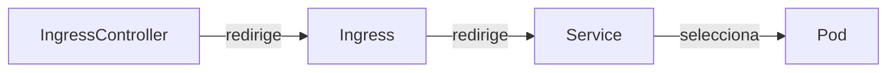

# Entrada al cluster

Hasta ahora todo lo que estaba _dentro_ de Kubenetes se quedaba en Kubernetes.

Dentro del cluster podíamos acceder a los servicios internos usando los nombres de los servicios.

Pero desde fuera... ¿cómo accedemos a los servicios que están dentro del cluster?

Mediante un Ingress, y un servicio.



*NOTA* El API de Ingress está actualmente congelada. Kubernetes recomienda usar [Gateway API](https://gateway-api.sigs.k8s.io/) en su lugar, aunque es mucho más compleja.

Ejemplo de servicio:
```yaml
apiVersion: v1
kind: Service
metadata:
  name: fake-webserver-svc
spec:
  selector:
    app.kubernetes.io/name: fake-webserver
  ports:
    - protocol: TCP
      port: 80
      targetPort: 9000
```

Ejemplo de ingress:
```yaml
apiVersion: networking.k8s.io/v1
kind: Ingress
metadata:
  name: fake-webserver
spec:
  rules:
  - host: 
    http:
      paths:
      - path: /
        pathType: Prefix
        backend:
          service:
            name: fake-webserver-svc
            port:
              number: 8080
```

Falta por configurar un ingressController.

Hay muchos para elegir. El más popular era nginx, pero hay otros como Traefik, HAProxy, etc...

Los ingressControllers se configuran con un manifest de Kubernetes como este:

```yaml
apiVersion: networking.k8s.io/v1
kind: IngressClass
metadata:
  name: traefik
  annotations:
    ingressclass.kubernetes.io/is-default-class: "true"
spec:
  controller: traefik.io/ingress-controller
```
