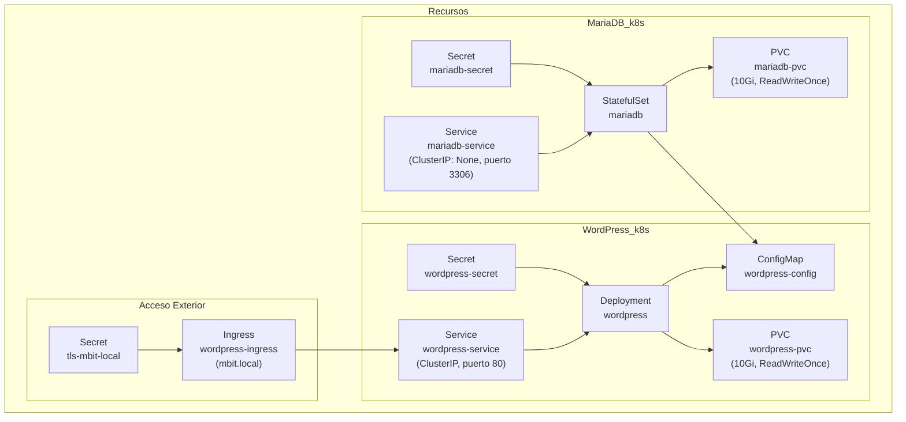

# Ejemplo de aplicación Wordpress en K8s

## Diagrama de despliegue


## Configuración

*Antes* de desplegar hay que crear un certificado que usará el ingress controller.
Lo más fácil es hacerlo desde línea de comandos:

```bash
openssl req -x509 -nodes -days 365 -newkey rsa:2048 \
  -keyout tls.key -out tls.crt \
  -subj "/CN=mbit.local/O=mbit.local" \
  -addext "subjectAltName=DNS:mbit.local"

kubectl create secret tls tls-mbit-local --key=tls.key --cert=tls.crt
rm tls.key tls.crt
```

Para acceder al dominio `mbit.local` tendrás que apuntar el fichero de hosts a 127.0.0.1
(o a la IP del equipo en el que está el cluster si lo quieres probar desde fuera).

## Claves (secrets)

Acuérdate de cambiar las claves que están en el fichero que declara los secrets.
No son muchas claves, pero están en un GIT público -> CAMBIALO antes de desplegar.

## Almacenamiento

Wordpress necesita una base de datos mySQL (mariaDB) para almacenar la información de los posts.
Las imágenes, temas y plugins están en un directorio aparte (`wp-content`).

Esta necesidad de almacenamiento se configura mediante un PVC que se monta como volúmen en los pods.


